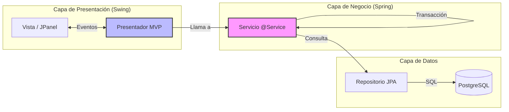
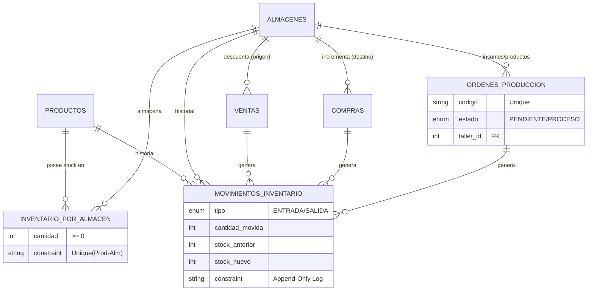
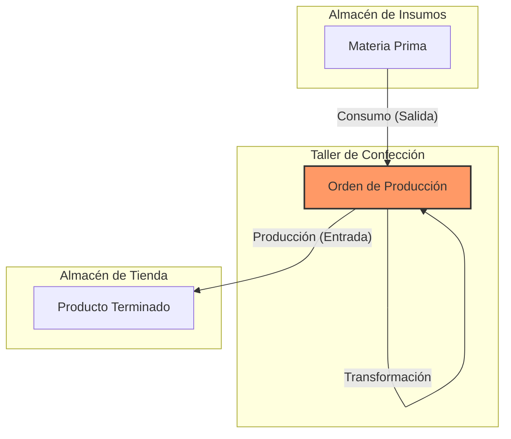

# Samvitex - Industrial ERP & POS (Desktop)

Samvitex ERP es una solución de gestión empresarial de escritorio (On-Premise) de alto rendimiento, diseñada y desarrollada a medida para una empresa de manufactura textil ubicada en el emporio comercial de Gamarra, Lima.

A diferencia de los sistemas de punto de venta (POS) genéricos, este software integra el **ciclo completo de manufactura textil**: desde la adquisición de materia prima y su transformación mediante Órdenes de Producción, hasta la distribución y venta en múltiples sucursales físicas.

---

## Recorrido del Sistema

A continuación se presentan algunos de los módulos principales que componen la solución tecnológica:

<table>
  <tr>
    <th width="50%">1. Seguridad & Acceso Multimedia</th>
    <th width="50%">2. Dashboard & BI</th>
  </tr>
  <tr>
    <td>
      Login inmersivo con video de fondo (VLCJ) y autenticación segura.
        
      <video src="https://github.com/user-attachments/assets/9a08fa9b-3da8-4a4c-be85-238e37678ce5" controls="controls" width="100%"></video>
    </td>
    <td>
      KPIs en tiempo real, valoración de inventario y gráficos de tendencias.
        
      
    </td>
  </tr>
</table>

<table>
  <tr>
    <th width="50%">3. Gestión de Manufactura</th>
    <th width="50%">4. Punto de Venta (POS)</th>
  </tr>
  <tr>
    <td>
      Control de Órdenes de Producción: Transformación de insumos en productos.
        
      
    </td>
    <td>
      Interfaz optimizada para lectura de códigos de barras y venta rápida.
        
      
    </td>
  </tr>
</table>

<table>
  <tr>
    <th width="50%">5. Inventario Multi-Almacén</th>
    <th width="50%">6. Reportes</th>
  </tr>
  <tr>
    <td>
      Vista global de stock con filtrado inteligente y estados de alerta.
        
      
    </td>
    <td>
      Control detallado de contabilidad y de entradas - salidas de inventario
         
      
    </td>
  </tr>
</table>

---

## Arquitectura e Ingeniería

El sistema implementa una arquitectura **Monolítica Modular** que emula la separación de responsabilidades de los microservicios, desplegada en un cliente rico (Rich Desktop Client).

### Patrón MVP (Model-View-Presenter)
Para garantizar la testabilidad y el mantenimiento, se desacopló estrictamente la lógica de negocio de la interfaz gráfica Swing:

### Decisiones Técnicas Clave
1.  **Integración Spring Boot + Swing:** Uso del contenedor de Inyección de Dependencias (IoC) de Spring para gestionar el ciclo de vida de los componentes de escritorio, operando en modo `headless(false)`.
2.  **Concurrencia Segura (`SecureSwingWorker`):** Implementación personalizada de `SwingWorker` que propaga el `SecurityContext` a hilos en segundo plano, permitiendo operaciones pesadas (reportes, transacciones masivas) sin congelar la interfaz de usuario (EDT).
3.  **Modelo Multi-Almacén Real:** La base de datos no almacena el stock como un atributo simple en la tabla de productos. Se utiliza una entidad relacional `inventario_por_almacen` con restricciones `UNIQUE` compuestas para gestionar existencias por ubicación física específica.

---

## Diseño de Base de Datos y Transaccionalidad

La integridad de los datos es la prioridad crítica del sistema. Se delegan reglas de negocio al motor de base de datos **PostgreSQL**.

*   **Auditoría Inmutable (Kardex):** La tabla `movimientos_inventario` funciona como un *Append-Only Log*. Los registros de movimientos nunca se actualizan ni eliminan, garantizando trazabilidad forense.
*   **Transacciones ACID:** Flujos complejos como la **Venta** o la **Producción** son atómicos. Si falla la generación del registro de auditoría, se revierte toda la operación comercial.
*   **Tipos Fuertes:** Uso de `ENUM` nativos de PostgreSQL para estados y tipos de movimiento, asegurando la consistencia del dominio a nivel de base de datos.
*   **Versionado de Esquema:** Gestión automatizada de migraciones DDL y DML utilizando **Flyway**.

---

## Flujos de Negocio

### 1. Ciclo de Vida de Producción (Manufactura)
El sistema resuelve el desafío de transformar inventario (telas, botones) en nuevos activos (prendas) entre ubicaciones distintas:
*   **Planificación:** Creación de la orden sin afectar stock físico.
*   **Producción:** Descuento atómico de insumos del *Almacén de Materia Prima*.
*   **Finalización:** Ingreso de productos terminados al *Almacén de Tienda* y cálculo de costos.

### 2. Punto de Venta (POS) de Alto Rendimiento
*   **Integración de Hardware:** Captura de eventos de lectores de códigos de barras (Code 128) mediante protocolos HID y gestión inteligente del foco de ventana.
*   **Generación de Documentos:** Motor de renderizado de PDFs en memoria para emisión instantánea de comprobantes sin operaciones de E/S en disco innecesarias.

---

## Stack Tecnológico

| Área | Tecnologías |
| :--- | :--- |
| **Lenguaje & Core** | Java 21 LTS, Spring Boot 3.x (Non-Web). |
| **Interfaz de Usuario** | Java Swing, FlatLaf (Temas Modernos), MigLayout. |
| **Persistencia** | Spring Data JPA, Hibernate, PostgreSQL. |
| **Seguridad** | Spring Security, BCrypt Hashing. |
| **Herramientas & DevOps** | Maven, Flyway, Docker, Git. |
| **Librerías Adicionales** | VLCJ (Multimedia), IcePDF/OpenPDF (Reportes). |

---

## Estado del Proyecto y Licencia

Este repositorio se publica con fines de **Portafolio Profesional** y demostración técnica. El código fuente representa una solución en producción para un cliente real.

**Nota sobre contribuciones:** Dado que este es un producto comercial licenciado a un cliente específico, el repositorio se mantiene como una instantánea de solo lectura ("Read-Only"). No se aceptan Pull Requests ni Issues externos.
